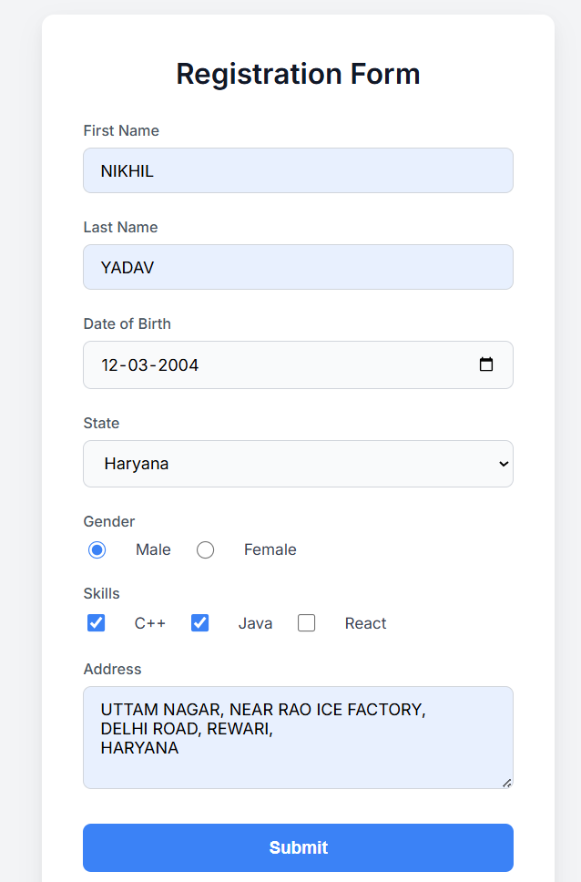
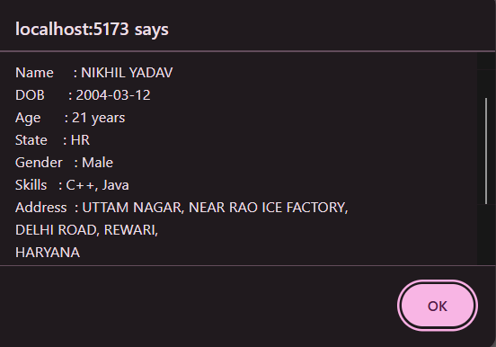
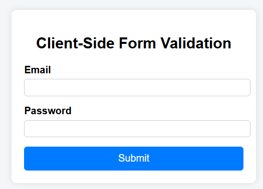
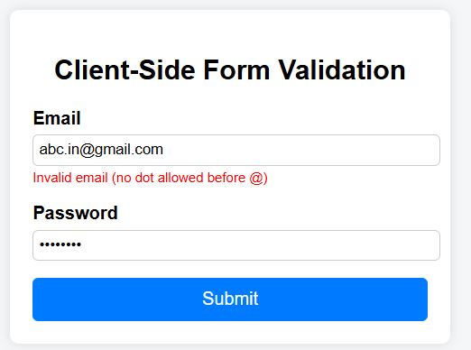
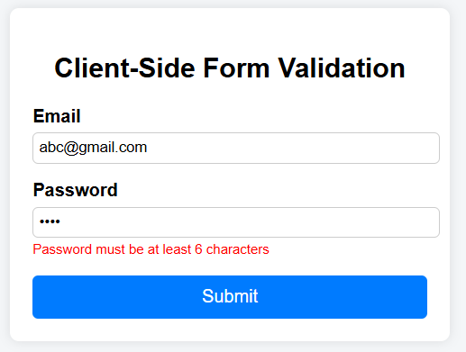
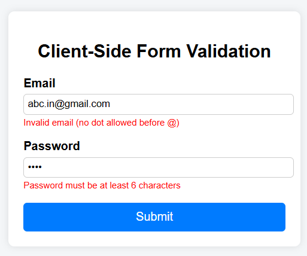
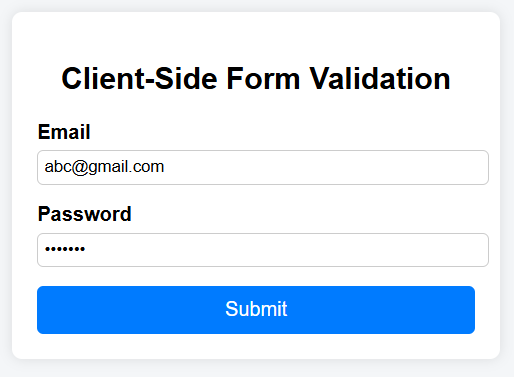

# React Forms Experiments

This repository contains React experiments related to handling forms using controlled components and implementing client-side form validation.

---

## Experiment – 1: Handling Forms Using Controlled Components

### Aim
To create and handle forms in a frontend application using controlled components in React.

### Software Requirements
- Node.js  
- React  
- VS Code  
- Web Browser  

### Theory
Controlled components are React components in which form data is handled by the component’s state. This provides complete control over user input.

### Procedure
1. Create a React application.
2. Create a form component.
3. Use `useState` to store input values.
4. Handle input change events.
5. Submit the form using an event handler.

### Outcome
- Learned how controlled components work in React.
- Managed form data using state.
- Successfully handled form submission.

### Screenshots
Home page of the form

Form submission output  

---

## Experiment – 2: Client-Side Form Validation

### Aim
To validate form inputs on the client side before submission.

### Theory
Client-side validation ensures correctness of user data and provides immediate feedback without server interaction.

### Procedure
1. Create form inputs.
2. Define validation conditions.
3. Display error messages.
4. Allow submission only for valid data.

### Outcome
- Implemented validation logic.
- Displayed error messages for invalid inputs.
- Allowed submission only for valid data.

### Screenshots
- Initial form state 

- Validation error messages  

- Successful form submission  

---

## Conclusion
These experiments provide a clear understanding of form handling and client-side validation in React, improving user experience and data accuracy.